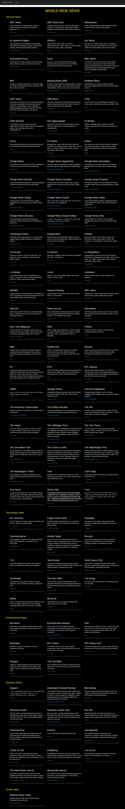

# {News_API}

#### {application that will help them list and preview news articles from various sources.}, {23 November 2020}
#### By **{UMUTONI Marie Ritha}**

## Description

{The News API (Links to an external site.) provides a wonderful API that will allow you to complete your task. Read the documentation in order to fully access the features of the API, learn how to use it and know how to implement features that are required for your project.. }

## Cloning

* UBUNTU
* Open Terminal
* Google Chrome
* internet
* [git clone](https://github.com/UMUTONIRitha/News_API.git)

## Application Used

* Python
* Flask
* Heroku

## Technology Used

* Python 3.6

## BDD

* As a user, I would like to see various news sources on the homepage of the application.
* As a user, I would also want to select a news source and see all news articles from the selected news source in the application.
* As a user, I would want to see the image, description and the time a news article was created.
* As a user, I would want to click on an article and read the full article on the source website.

## How Password-Locker Project look

## Contact Information

{feel free to contact me via E-mail: rithamarie9@gmail.com in case you need any support or contribution.}

### License

* MIT license,Copyright (c) {2020} **{UMUTONI Marie Ritha}**